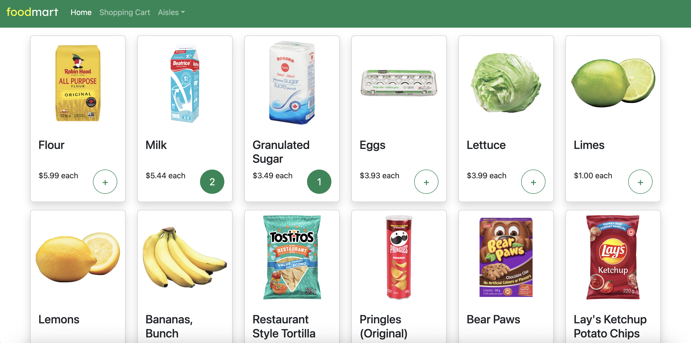
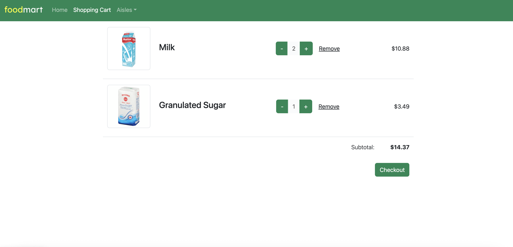

### Welcome!

Thank you for checking out my demo e-commerce website for a fake supermarket called FoodMart!

This was built using **Django** and **Bootstrap**.

---

Here are some screenshots of the app (home page and shopping cart):




---

### Downloading & Running the Project

1. Download this repository to your local computer. Make sure you already have ```python``` and ```pip``` installed.
2. Install the required dependencies in the project folder: ```pip install -r requirements.txt```
3. Generate a new secret key (instructions at the bottom of this file), and then create a .env file, and paste your secret key in the file in this format: ```DJANGO_SECRET_KEY={your secret key}```
4. Run server: ```python manage.py runserver```

---

### Credits
I obtained the food pictures and descriptions from Loblaws' website: https://www.loblaws.ca/en

___

### Generating a New Secret Key

To generate a new secret key:
1. Navigate to your Django project's root directory in your terminal and run: ```python manage.py shell```
2. Enter this line: ```from django.core.management.utils import get_random_secret_key```
3. Push enter, then enter this line: ```print(get_random_secret_key())```
4. The shell will output a long string of random characters. Copy this string.